# Hello-App: Pipeline CI/CD e GitOps Completa

## Visão Geral

Este projeto foi desenvolvido como parte do programa de bolsas Cloud & DevSecOps da Compass UOL.
O repositório demonstra, na prática, uma pipeline completa de Integração Contínua (CI), Entrega Contínua (CD) e GitOps, utilizando uma aplicação FastAPI como exemplo de workload.

## Objetivo Principal

Automatizar o ciclo completo de desenvolvimento, build, deploy e execução de uma aplicação FastAPI simples, usando GitHub Actions para CI/CD, Docker Hub como registry, e ArgoCD para entrega contínua em Kubernetes local com Rancher Desktop. 

## Tecnologias e Ferramentas Utilizadas

* Linguagem/Framework: Python 3.12 + FastAPI.

* Contêinerização: Docker + Rancher Desktop.

* Orquestração: Kubernetes (via Rancher Desktop).

* CI/CD: GitHub Actions.

* GitOps/CD: ArgoCD.

* Registro de Imagens: Docker Hub.


## Pré-requisitos 

* Conta no GitHub: (Repositório público com Actions habilitadas).

* Conta no Docker Hub: (com token de acesso configurado no GitHub Actions).

* Rancher Desktop: Instalado e com o Kubernetes habilitado.

* kubectl: Configurado e apontando para o cluster Rancher Desktop (kubectl get nodes).

* ArgoCD: Instalado no cluster local.

* Git e Python 3 instalados localmente

## Fluxo de Trabalho

1.  **Commit do Código:** Um git push no repositório `hello-app` aciona o workflow.

2.  **CI/Build (GitHub Actions):** O workflow `ci-cd.yml` é acionado automaticamente.
    * Constrói a imagem Docker a partir do `Dockerfile`.
    * Faz o *push* da imagem versionada para o Docker Hub.

3.  **CD/GitOps (GitHub Actions):** Após o *push* bem-sucedido:
    * O workflow **atualiza um arquivo de manifesto** no repositório de configuração `hello-manifests`.
   
4.  **Deploy (ArgoCD):**
    * O **ArgoCD** monitora o repositório de manifestos.
    * Ao detectar o *commit* com a nova tag, ele sincroniza o estado do cluster, aplicando a nova versão da aplicação.

5.  **Execução:** A nova versão da aplicação FastAPI entra em execução no Kubernetes.
   

## Etapa 1 - Criação dos Repositórios

Antes de configurar a pipeline de CI/CD e o GitOps, é necessário preparar dois repositórios: um para o código da aplicação (Hello-App) e outro para os manifestos Kubernetes (Hello-Manifests).

### Etapa 1.1 - Repositório Principal (Hello-App)

Este repositório vai conter o código-fonte da aplicação FastAPI e o workflow do GitHub Actions responsável pelo processo de build, push e atualização dos manifestos. 

Estrutura inicial:
```
hello-app/
├── app/                     # Diretório onde vai ficar o código principal da aplicação FastAPI
├── .github/
│   └── workflows/           # Diretório para o workflow do GitHub Actions (Build, Push e Commit no repositório dos manifestos "hello-manifests")
└── README.md                # Documentação do projeto
```

Os arquivos específicos (main.py, Dockerfile e ci-cd.yml) serão criados nas próximas etapas.

### Etapa 1.2 - Repositório de Manifestos

O segundo repositório, `hello-manifests`, será utilizado para armazenar os arquivos de manifesto Kubernetes utilizados pelo ArgoCD.

👉 [Ir para Hello-Manifests](https://github.com/StefaniRitter/Hello-Manifests)


## Etapa 2 - Criação da Aplicação FastAPI

No repositório principal, em `hello-app/app/`, foi criado o arquivo main.py com o conteúdo abaixo:
```
from fastapi import FastAPI 

app = FastAPI() 
@app.get("/") 
async def root(): 
    return {"message": "Hello World"} 
```

## Etapa 3 - Criação do Dockerfile

Para empacotar e executar a aplicação em um container, foi criado um Dockerfile com as seguintes instruções:
```
FROM python:3.11-slim
WORKDIR /app
RUN pip install fastapi uvicorn
COPY app/ ./app
EXPOSE 8000
CMD ["uvicorn", "app.main:app", "--host", "0.0.0.0", "--port", "8000"]
```

* `FROM python:3.11-slim`: usa uma imagem Python leve e recente.
* `WORKDIR /app`: define onde o código vai rodar dentro do container.
* `RUN pip install fastapi uvicorn`: instala o FastAPI e o servidor Uvicorn.
* `COPY app/ ./app`: copia a pasta app (onde está main.py) para o container.
* `EXPOSE 8000`: indica a porta que o FastAPI vai usar.
* `CMD ["uvicorn", "app.main:app", "--host", "0.0.0.0", "--port", "8000"]`: executa o servidor Uvicorn quando o container inicia.

## Etapa 4 - Criação dos Segredos no GitHub

Para que a pipeline funcione corretamente, é necessário criar algumas variáveis (secrets) no GitHub. 
Essas variáveis são criadas dentro do repositório Hello-App, em **Settings → Secrets and variables → Actions → New repository secret**

1. **DOCKER_USERNAME:**
   * **Name***: DOCKER_USERNAME
   * **Secret***: <Seu_Nome_de_Usuário_DockerHub>
* Clique em `Add secret`

2. **DOCKER_PASSWORD:**
   * **Name***: DOCKER_PASSWORD
   * **Secret***: <Seu_Token_de_Acesso_do_DockerHub>
   
⚠️ O Token de Acesso não é a sua senha!

Para criar um token, [Acesse os tokens de acesso pessoal do Docker](https://app.docker.com/settings/personal-access-tokens) e clique em “New Access Token”.

Dê um nome (ex: github-actions), copie o token gerado e cole no campo Secret* (valor) de DOCKER_PASSWORD.

3. **PAT - Personal Access Token (Classic) com permissão de escrita no repositório dos manifests:**
   * **Name***: PAT
   * **Secret***: <Seu_PAT>

Para gerar o Personal Access Token, acesse [https://github.com/settings/tokens](https://github.com/settings/tokens) e clique em **“Generate new token (classic)”**.

Preencha as informações:
   * **Note**: github-actions
   * **Expiration**: No expiration
   * **Scopes**: Marque a opção "Repo"

Clique em "Generate Token".
Copie o token gerado e cole no campo Secret* (valor) de PAT.

Resultado:

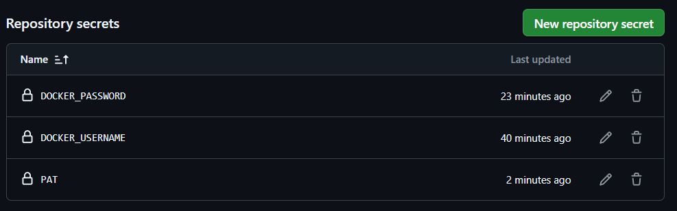

## Etapa 5 - Configuração do GitHub Actions 

Nesta etapa será implementado o pipeline de Integração e Entrega Contínua (CI/CD) utilizando o GitHub Actions para buildar e fazer a publicação da imagem no Docker Hub (container registry), realizar um Pull Request automaticamente no repositório de manifestos e alterar a imagem sempre que necessário.

### Etapa 5.1 - Criação do Arquivo de Workflow

Em `.github/workflows/` foi criado um arquivo com nome `ci-cd.yml` com o seguinte conteúdo:
```
name: CI/CD

on:
  push:

jobs:
  build:
    runs-on: ubuntu-latest

    steps:
      - name: Checkout do Código
        uses: actions/checkout@v4

      - name: Login no Docker Hub
        uses: docker/login-action@v3
        with:
          username: ${{ secrets.DOCKER_USERNAME }}
          password: ${{ secrets.DOCKER_PASSWORD }}

      - name: Build e Push da Imagem
        uses: docker/build-push-action@v5
        with:
          context: .
          push: true
          tags: |
            ${{ secrets.DOCKER_USERNAME }}/hello-app:${{ github.sha }}
            ${{ secrets.DOCKER_USERNAME }}/hello-app:latest
  deploy:
    runs-on: ubuntu-latest
    needs: build

    steps:
      - name: Clone do Repo de Manifests
        uses: actions/checkout@v4
        with:
          repository: StefaniRitter/Hello-Manifests
          token: ${{ secrets.PAT }}
          path: Hello-Manifests

      - name: Atualizar tag da imagem no Repo de Manifests
        run: |
          cd Hello-Manifests
          sed -i "s|image: .*/hello-app:.*|image: ${{ secrets.DOCKER_USERNAME }}/hello-app:${{ github.sha }}|g" deployment.yaml
          git config user.name "GitHub Actions"
          git config user.email "actions@github.com"
          git add deployment.yaml
          git commit -m "Atualizando a imagem hello-app para ${{ github.sha }}" || echo "Nenhuma alteração necessária."

      - name: Pull Request no Repo de Manifests
        uses: peter-evans/create-pull-request@v6
        with:
          token: ${{ secrets.PAT }}
          commit-message: "Atualização da imagem hello-app para ${{ github.sha }}"
          title: "Atualização da imagem hello-app para ${{ github.sha }}"
          body: "Atualização automática do manifesto Kubernetes com a nova imagem Docker da aplicação."
          branch: att-hello-app-${{ github.sha }}
          base: main
          delete-branch: true
          path: Hello-Manifests
```

O pipeline é executado automaticamente quando acontece um push, e é dividido em duas fases (jobs):

1. Build:
   * Faz login no Docker Hub com os Secrets definidos.
   * Constrói a imagem Docker da aplicação FastAPI.
   * Envia (push) a imagem para o Docker Hub com as tags.

2. Deploy
   * É executado somente depois do build (needs: build).
   * Clona o repositório Hello-Manifests.
   * Atualiza a tag da imagem no arquivo deployment.yaml.
   * Cria um Pull Request automático para atualizar os manifests.

Após essas etapas, podemos ver na interface do Docker Hub que a imagem `hello-app` foi construída com sucesso:

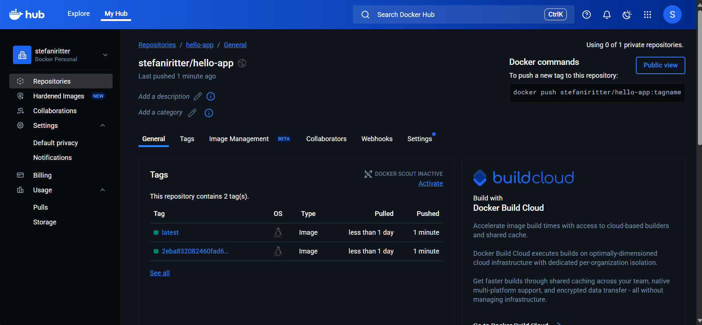

No repositório Hello-Manifests ainda não acontece o Pull-Request, pois ainda não foram criados os arquivos de manifesto `deployment.yaml` e `service.yaml`. Isso será feito nas próximas etapas.

## Etapa 6 - Criação dos Manifestos Kubernetes

Como dito anteriormente, nessa etapa serão cridos os arquivos de manifesto Kubernetes, que serão utilizados pelo ArgoCD para realizar o deploy automático da aplicação FastAPI.

### Etapa 6.1 - Criação do deployment.yaml

No [Repositório de Manifestos](https://github.com/StefaniRitter/Hello-Manifests), foi criado um arquivo chamado `deployment.yaml`, com o conteúdo abaixo:

```
apiVersion: apps/v1
kind: Deployment
metadata:
  name: helloApp-deployment
  labels:
    app: hello-app
spec:
  replicas: 2
  selector:
    matchLabels:
      app: hello-app
  template:
    metadata:
      labels:
        app: hello-app
    spec:
      containers:
        - name: hello-app
          image: stefaniritter/hello-app:latest
          ports:
            - containerPort: 8000
```

Esse manifesto do Kubernetes define um Deployment, que serve para gerenciar réplicas de um pod:

* `apiVersion`: Define a versão da API do Kubernetes que está sendo usada para criar o Deployment.
  
* `kind`: Indica que está sendo criado um Deployment, que é responsável por:
   * Criar pods com base na configuração.
   * Garantir que o número desejado de réplicas esteja sempre rodando.
   * Fazer atualizações rolling update sem downtime.
     
* `metadata`: Informações sobre o deployment (nome, labels).
  
* `spec`: Define o comportamento do deployment, como número de réplicas dos pods e quais pods serão monitorados.
  
* `template`: É o modelo que define como os pods serão criados:
  * **metadata.labels**: rótulo do pod
  * **spec.containers**: lista de containers do pod, que nesse caso é o container `hello-app`, que usa a imagem `stefaniritter/hello-app:latest` e fica exposto na porta 8000.


### Etapa 6.2 - Criação do service.yaml

No mesmo repositório `Hello-Manifests`, também foi criado o arquivo `service.yaml`, que tem o seguinte código:

```
apiVersion: v1 
kind: Service
metadata:
  name: helloApp-Service
spec:
  selector:
    app: hello-app
  ports:
    - protocol: TCP
      port: 80
      targetPort: 8000
  type: ClusterIP
```

Esse manifesto define um Service, que funciona como um ponto de acesso estável para os pods. Ele permite que outros pods ou usuários dentro do cluster acessem os pods sem precisar saber os nomes ou IPs individuais deles.


Com os arquivos criados, na próxima vez que for realizado um Push, o GitHub Actions vai gerar automaticamente um Pull Request no repositório de manifests, atualizando a tag da imagem com o SHA do commit, e o ArgoCD poderá sincronizar automaticamente os deploys:

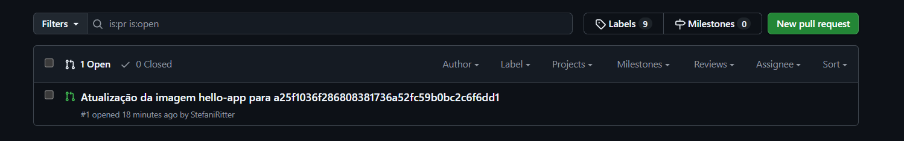

## Etapa 7 - Criação do App no ArgoCD 

Nessa etapa será realizada a criação da aplicação no ArgoCD, que vai monitorar o repositório `Hello-Manifests` e aplicar automaticamente as alterações no cluster Kubernetes.

Importante: para executar as próximas etapas, foi usado o Windows PowerShell.

### Etapa 7.1 - Instalação do ArgoCD

Com o Rancher Desktop aberto e o status do cluster mostrando "Kubernetes is running", execute os seguintes comandos no terminal (se ainda não tiver o ArgoCD instalado):
```
kubectl create namespace argocd
```

```
kubectl apply -n argocd -f https://raw.githubusercontent.com/argoproj/argo-cd/refs/heads/master/manifests/install.yaml

```

### Etapa 7.2 - Acessar o ArgoCD localmente

Para acessar a interface web (UI) e a CLI do ArgoCD a partir do navegador/terminal, é necessário abrir uma conexão entre o localhost e o Service do ArgoCD.

Para encaminhar o tráfego da porta 443 do serviço (svc) chamado argocd-server no Namespace argocd para a porta 8080 no localhost, execute o seguinte comando:
```
kubectl port-forward svc/argocd-server -n argocd 8080:443
```
No navegador, acesse o ArgoCD através do endereço `https://localhost:8080`.

Ao acessar o ArgoCD, verá que é necessário informar usuário e senha para o login. O usuário padrão do ArgoCD é o `admin`, e a senha pode ser gerada com o seguinte comando em outro terminal:
```
kubectl -n argocd get secret argocd-initial-admin-secret -o jsonpath="{.data.password}" | %{[System.Text.Encoding]::UTF8.GetString([System.Convert]::FromBase64String($_))}
```

Depois é só copiar a senha e acessar o ArgoCD:

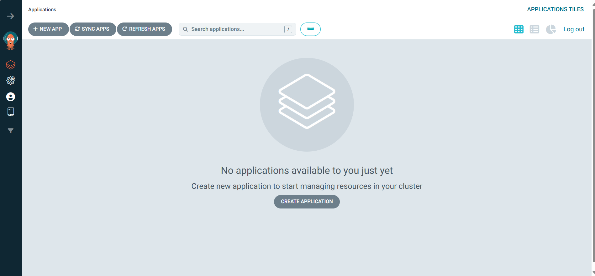

### Etapa 7.3 - Criação do App

Na página inicial do ArgoCD, em **Applications**, clique em **"New App"** e preencha as informações:

* **Application Name**: hello-app
* **Project name**: default
* **Sync Policy**: Automatic
  
* Habilite: 
   * ✅ Sync Policy → Automatic
   * ✅ Prune Resources
   * ✅ Self Heal
   * ✅ Set Deletion Finalizer
   * ✅ Auto-Create Namespace

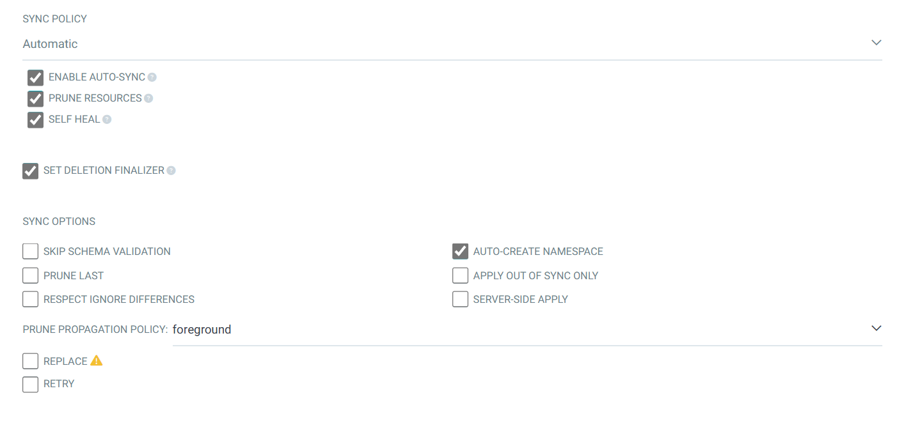

* **Repository URL**: [(https://github.com/StefaniRitter/Hello-Manifests)](https://github.com/StefaniRitter/Hello-Manifests) (substitua por suas informações)
* **Revision**: main
* **Path**: . (pois os arquivos estão na raiz)
* **Cluster Name**: in-cluster
* **Namespace**: hello-app

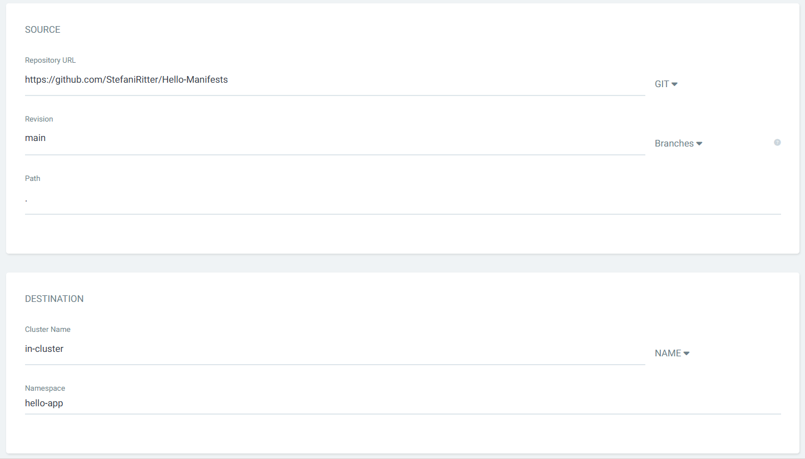

**Clique em create**

Após alguns segundos, o ArgoCD completará a sincronização e os status devem aparecer como **Healthy** e **Synced**, indicando que tudo está funcionando como o esperado:

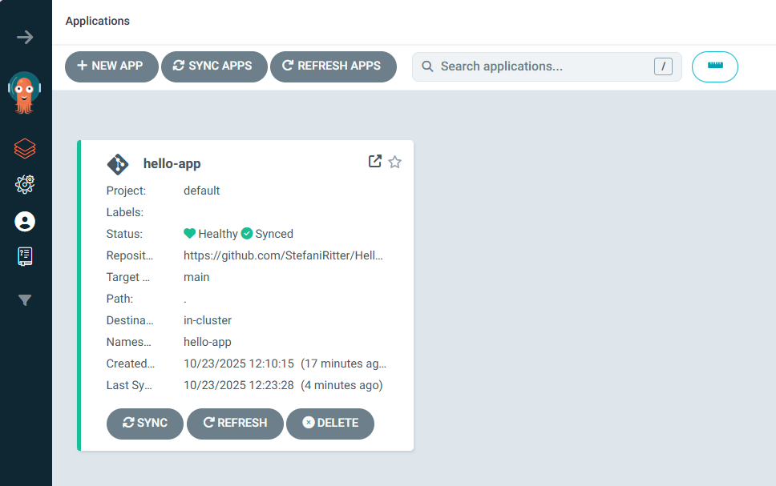


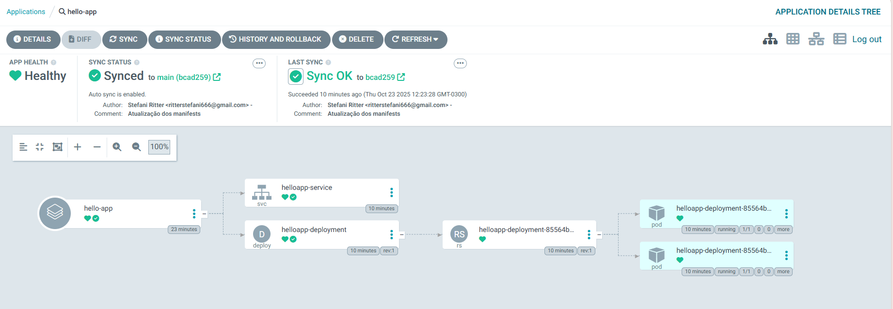


Como pode-se notar nas imagens acima, a aplicação foi criada e sincronizada no ArgoCD, e a partir de agora qualquer atualização no repositório de manifestos será aplicada automaticamente no cluster kubernetes.

## Etapa 8 - Acessando Aplicação

Nesta etapa, será acessada a aplicação via port-forward.

No terminal, execute o seguinte comando:
```
kubectl get pods -n hello-app
```

Copie o nome de um dos pods e rode o comando abaixo, substituindo <NOME_DO_POD> pelo nome copiado:
```
kubectl port-forward <NOME_DO_POD> -n hello-app 8000:8000
```

Exemplo:
```
kubectl port-forward helloapp-deployment-7967849dc-dkj54 -n hello-app 8000:8000
```

E depois basta acessar o endereço `http://localhost:8000/` pelo seu navegador para ver a aplicação:

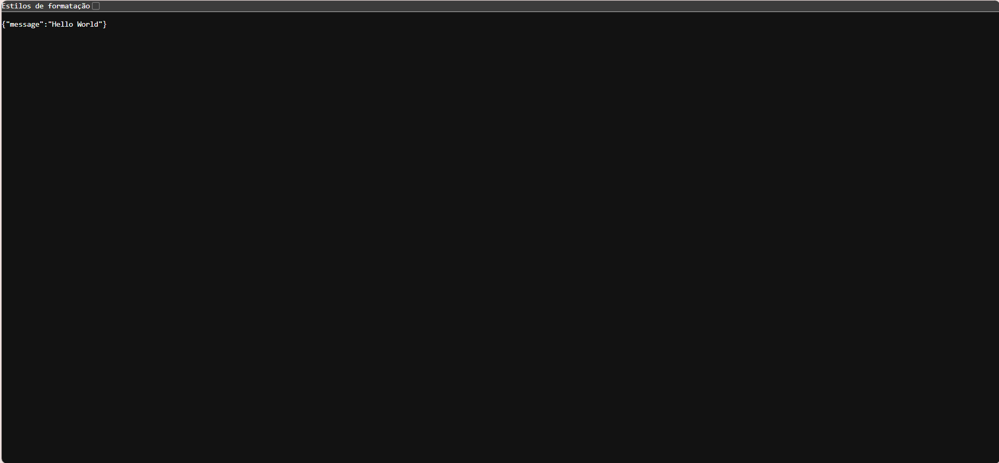

Atenção: o endereço que deve ser usado é **http://** e não https://.


✅ Aplicação funcionando!

## Etapa 9 - Modificação da Mensagem

Chegamos na última etapa, onde será alterado o repositório da aplicação, modificando a mensagem dentro do código python de "Hello World" para outra mensagem e verificando se após o processo de CI/CD a imagem foi atualizada no 
ambiente Kubernetes. 

### Etapa 9.1 - Alterar o código main.py

Em main.py, modifique a mensagem de "Hello World" para outra mensagem qualquer:
```
from fastapi import FastAPI 

app = FastAPI() 
@app.get("/") 
async def root(): 
    return {"message": "Imagem atualizada! O projeto foi concluído com sucesso!🎯🏅🎉"} 
```

### Etapa 9.2 - Realizar o commit

No git bash, rode os seguintes comandos para fazer o commit e push das alterações para o repositório:
```
git add .
git commit -m "Atualizando mensagem do arquivo main.py!"
git push -u origin main
```
Com isso, o GitHub Actions será disparado automaticamente, realizando o build da nova imagem, o push no Docker Hub, a alteração da tag no deployment.yaml do repositório de manifests e a criação de um Pull Request.

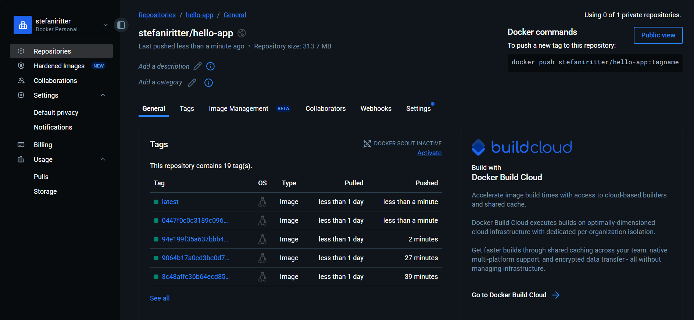

### Etapa 9.3 - Mesclar Pull Request

No repositório [Hello-Manifests](https://github.com/StefaniRitter/Hello-Manifests), em Pull Requests, clique no último Pull Request gerado.
CLique em Merge para aplicar as mudanças na branch principal:

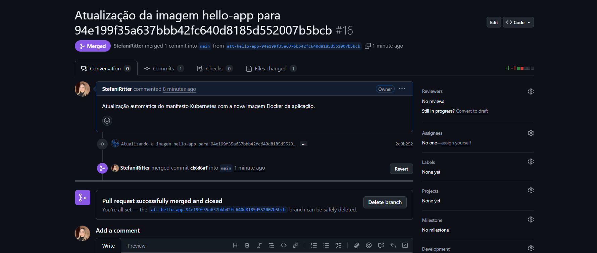


